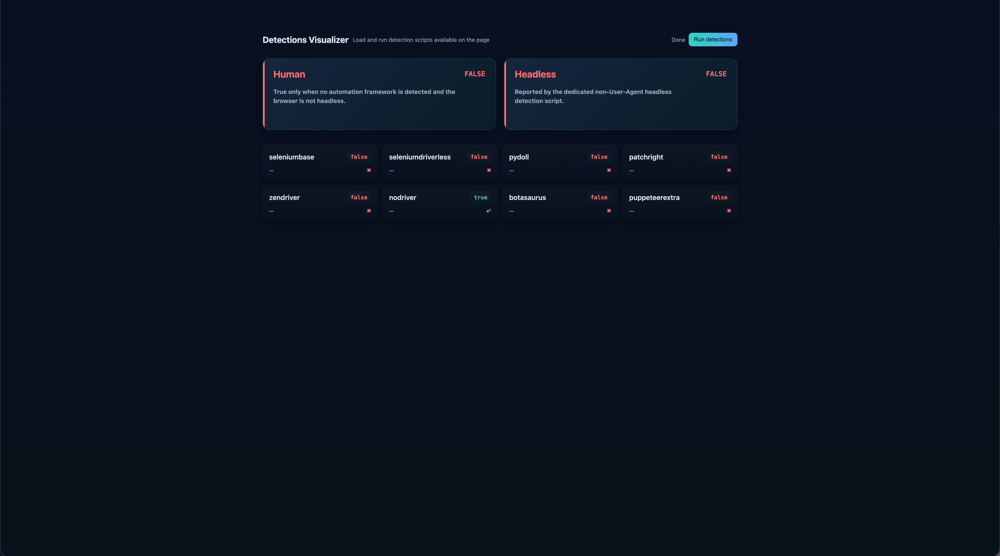

# Auto Browser Sniffer Testing Manual

This manual describes the miner testing workflow for AB Sniffer. Testing is primarily
semi-automated: miners run each supported automation framework against the challenge page
and inspect whether the page classifies the framework, browser mode, and human sessions
correctly.

## Prerequisites

- Docker with the Docker Compose plugin
- A browser for human checks
- Miner-controlled automation runners for the configured frameworks
- Test hosts or virtual machines for Linux, macOS, and Windows
- Network access from each test host to the challenge API

The active framework list is defined in
[`challenge.yml`](../src/abs_challenge/challenge/api/configs/challenge.yml). The current
targets are:

- `seleniumbase`
- `seleniumdriverless`
- `pydoll`
- `patchright`
- `zendriver`
- `nodriver`
- `botasaurus`
- `puppeteerextra`

Miners are responsible for developing, configuring, and running their own framework
implementations. This repository does not provide the miner-side framework runners.

> [!IMPORTANT]
> Miners must develop their own automation framework runners for local testing. These
> implementations may differ from the private runners used by the challenge because of
> browser versions, operating systems, framework settings, launch arguments, patches, and
> other environmental differences. Do not rely on one runner configuration or one observed
> signal. Test multiple implementations, launch modes, configurations, browser versions, and
> operating systems to make detection logic more robust.

## 1. Add Detection Scripts

Place all nine JavaScript files in:

```text
src/abs_challenge/challenge/templates/static/detections/
```

Keep the expected filenames and function names. The submission contains one detector for
each configured framework and a separate `headless.js` detector.

Before testing, validate the files:

```bash
python3 skills/validate-submission/scripts/validate_submission.py
```

## 2. Configure the Challenge

Create the local environment file:

```bash
cp .env.example .env
```

Open `.env` and set a private challenge API key:

```dotenv
ABS_CHALLENGE_API_KEY=replace_with_your_private_api_key
ABS_CHALLENGE_API_PORT=10001
```

The API key must be longer than eight characters and contain only letters, numbers,
underscores, and hyphens. Keep it private. Protected API endpoints require it in the
`X-API-Key` header.

If port `10001` is unavailable, change both port variables to the same available port.

## 3. Start the Challenge Container

From the repository root, use either command:

```bash
docker compose up -d
```

or:

```bash
./compose.sh start -l
```

The `-l` option starts the service and follows its logs. To view logs separately:

```bash
docker compose logs -f challenge-api
```

Confirm the service is running:

```bash
docker compose ps
curl http://localhost:${ABS_CHALLENGE_API_PORT:-10001}/health
```

## 4. Choose a Reachable Test URL

The detection page is served at:

```text
http://<challenge-host>:<port>/_web
```

Use the appropriate host value:

- Runner on the same machine: `http://localhost:10001/_web`
- Runner in another container: use a reachable Compose service name or host address
- Runner on another Linux, macOS, or Windows machine: use the challenge host's LAN IP or DNS
  name, for example `http://192.168.1.20:10001/_web`

`0.0.0.0` is a bind address. Do not use it as the destination for a runner on another
machine. Ensure the selected port is reachable through host firewalls and container port
mapping.

## 5. Test Every Framework

Run every configured framework against the `/_web` URL in both headed and headless mode
where the framework supports both modes.

Repeat testing on:

- Linux
- macOS
- Windows

If a framework or browser combination is unsupported on an operating system, record that
limitation rather than silently skipping it. Use consistent browser versions and runner
configuration when comparing results.

For each framework and mode:

1. Start a clean browser session.
2. Navigate to the `/_web` URL.
3. Wait for the page to show `Done`, or select **Run detections**.
4. Capture the displayed results.
5. Close the session and repeat enough times to detect unstable behavior.

The page should resemble the following:



## 6. Interpret the Results

For a framework run, a correct result has:

- the active framework set to `true`;
- every other framework set to `false`;
- **Human** set to `false`;
- **Headless** matching the actual browser mode.

For example, a headed `nodriver` run should report:

```text
nodriver: true
all other frameworks: false
Human: false
Headless: false
```

A headless `nodriver` run should produce the same framework classification with:

```text
Headless: true
```

A collision occurs when more than one framework detector returns `true`. Remove collisions
before submission because they reduce framework accuracy and can create human false
positives.

## 7. Test Human Sessions

Open `/_web` manually in a normal headed browser without an automation framework.

A correct human result has:

```text
all frameworks: false
Human: true
Headless: false
```

Human testing is mandatory. Any framework or headless detector firing during a human task
can reduce the complete challenge score to zero.

Test multiple fresh human sessions on Linux, macOS, and Windows. Include normal browser
interaction such as navigation, pointer movement, typing, scrolling, and developer tools
usage where relevant.

## 8. Check Headless Results

Headless testing is semi-automated. Two possible approaches are:

### Screenshot Approach

Run the framework in headless mode, wait for detection to complete, and take a screenshot of
the page. Inspect the framework cards and the **Headless** result.

### Miner-Implemented Result Capture

Miners may modify their own testing setup to place detection results in `localStorage` and
retrieve them through their framework runner.

This approach is only a suggestion:

- it is not implemented or supported by the RedTeam challenge;
- miners must design and maintain the result-capture mechanism;
- changing the testing page or detector behavior may invalidate the test;
- RedTeam is not responsible for the accuracy or reliability of miner-side result capture.

Do not include testing-only storage or extraction logic in the final submission unless it is
explicitly allowed by the challenge requirements.

## 9. Record a Test Matrix

Record at least:

| OS    | Framework | Browser          | Mode   | Expected | Actual true | Headless | Collision | Pass |
| ----- | --------- | ---------------- | ------ | -------- | ----------- | -------- | --------- | ---- |
| Linux | nodriver  | Chromium version | Headed | nodriver | nodriver    | false    | No        | Yes  |

Include repeated runs and human sessions. A submission is ready only when results are stable,
framework-specific, collision-free, and correct for headed/headless modes.

## Troubleshooting

- **Page is unreachable:** verify `docker compose ps`, port mapping, firewall rules, and the
  host address used by the runner.
- **Remote runner uses `localhost`:** replace it with the challenge host's reachable IP or
  DNS name.
- **Changes do not appear:** rebuild or recreate the challenge container, then start a fresh
  browser session without cache.
- **No detector runs:** inspect the browser console and challenge logs for JavaScript errors.
- **Multiple detectors are true:** isolate shared signals and tighten framework-specific
  conditions.
- **Human is false in a manual browser:** at least one framework detector or the headless
  detector produced a false positive.
- **Headless result is unstable:** repeat clean sessions across browser versions and inspect
  screenshots before changing the detector.

Stop the environment when testing is complete:

```bash
docker compose down --remove-orphans
```
